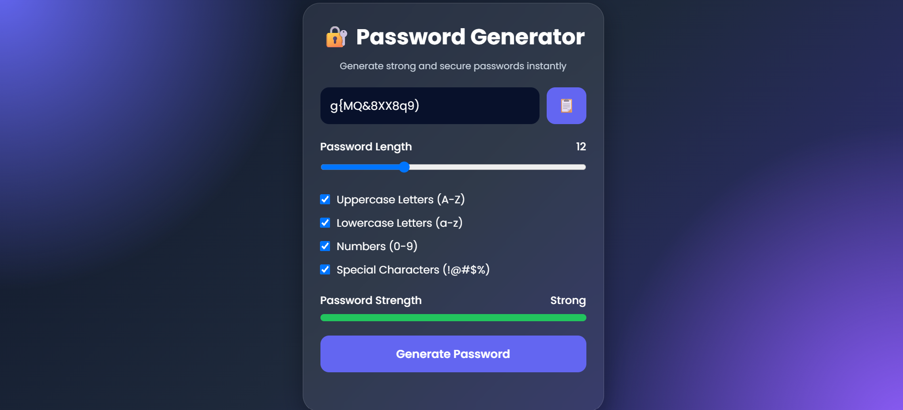

# Password Generator

A modern and responsive Password Generator Web Application built using HTML, CSS, and JavaScript. This application allows users to generate strong and secure passwords based on customizable criteria such as password length, uppercase letters, lowercase letters, numbers, and special characters.

## Live Demo

Add your GitHub Pages URL here after deployment.

## Features

* Generate secure random passwords instantly
* Adjustable password length (8–32 characters)
* Include uppercase letters (A-Z)
* Include lowercase letters (a-z)
* Include numbers (0-9)
* Include special characters (!@#$%^&*)
* Password strength indicator
* One-click copy to clipboard functionality
* Responsive and modern user interface
* Input validation for better user experience

## Technologies Used

* HTML5
* CSS3
* JavaScript (ES6)

## Project Structure

password-generator/

├── index.html

├── style.css

├── script.js

└── README.md

## How to Run Locally

1. Clone the repository:
   git clone https://github.com/Swastika20-ch/password-generator.git

2. Open the project folder.

3. Launch `index.html` in your browser.

No additional installations or dependencies are required.

## Project Preview

## Learning Outcomes

This project demonstrates:

* DOM Manipulation
* Event Handling
* JavaScript Functions
* Conditional Logic
* Random Password Generation
* Responsive Web Design
* Clipboard API Usage

## Author

**Swastika Chatterjee**

B.Tech CSE, KIIT University

GitHub: https://github.com/Swastika20-ch

## License

This project is developed for educational and internship learning purposes.
